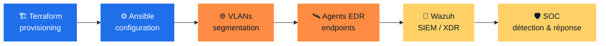

<!-- ░░ HEADER ░░ -->

  

  

  
  
  
  

---

### ⚡ En deux lignes

> **Je sécurise, je câble, je code — souvent les trois dans la même journée.**
> Alternant en cybersécurité & réseaux, en Mastère Expert Cybersécurité & Réseaux (RNCP niveau 7) au CFA-ITIS.

---

### 🛡️ Actuellement — seul responsable IT chez **GI Sûreté**

Toute l'IT interne passe par moi, de la baie réseau jusqu'à l'application métier.

| | Périmètre | Au quotidien |
|:-:|---|---|
| 🖧 | **Infrastructure** | Serveurs, virtualisation Proxmox, postes et parc |
| 🌐 | **Réseau** | Segmentation VLAN, accès, supervision |
| 💻 | **Dev web interne** | Appli de hotline PHP/MySQL : tickets, fiches d'intervention, PV — conception → prod |
| 🔐 | **Cybersécurité** | Durcissement, sécurité applicative (CSRF, XSS, IDOR), sauvegardes |

---

### 🧰 Compétences

**🖥️ Systèmes & Réseaux**
 

**🔐 Cybersécurité & Pentest**
 

**💻 Développement web**
 

**🏗️ DevOps & IaC**
 

---

### 🚀 Projet académique — **CYNA**

Conception d'une infrastructure de cybersécurité pour une offre **SaaS EDR / XDR / SOC** : réseau segmenté, déploiement entièrement automatisé, détection centralisée.

     

---

### 📊 En chiffres

  
  

  

---

### 📬 Me contacter

  
  

📍 Île-de-France

